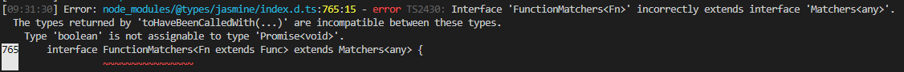

# Overview

Windows Admin Center is upgrading to Angular 11.0! This brings in the latest in features, security, and performance, and we're excited to have this available for you. So far, the shell of Windows Admin Center has been upgraded and it is your turn to update your extensions. Follow the steps in this document to get your extension updated.

# Preliminary steps

0. Install the latest version of Windows Admin Center in dev mode ('msiexec /i WindowsAdminCenter<version>.msi DEV_MODE=1') with the upgraded shell. Please reach out to your Microsoft contact if this has not been provided to you.
1. Create a `features/ng11` branch in the repo. [Recommended]
2. Update `version.json` version to `(N+1).0.0`. [Recommended]
3. In a Powershell console, make sure to switch to the respective Node version ([Working with two branches of shell](./Working-with-two-branches-of-shell.md) - At time of writing `nvm use 12.18.3`). Close the terminal for this change to take effect.
4. Cleanup `node_modules` folder to avoid npm conflicts.

# Automated process
## Prerequisites

5. Download and install WAC CLI tools by running `npm install -g @microsoft/windows-admin-center-sdk@experimental` if you have not already done so 

## Upgrade

6. At the root level of the repo, run `wac upgrade --audit=false --experimental`.
a. If working on an extension repository that is consumed by other extensions, include the `--library` flag as well.
    
    If the library flag was used, edit the `name` property in `src/package.json` to something unique to the extension.

7. [Conditional] If the extension repo has dependencies on any other extension package, you will have to manually pick the new angular version for that one (e.g. `msft-sme-certificate-manager` has a dependency on `msft-sme-event-viewer`. The automated tools will **not** update `msft-sme-event-viewer` version, it has to be manually updated.)
Also be sure to specify the '/dist' folder level on any imports from extensions, any lower or higher level imports won't work (e.g. `import { foobar } from '@msft-sme/event-viewer'` would need to be changed to `import { foobar } from '@msft-sme/event-viewer/dist'`.) 
8. Open `app-routing.module.ts` and change any appRoutes that have the format `./folder-name/file-name#ModuleClass` to `() => import('./folder-name/file-name').then(m => m.ModuleClass)`. If there are any other `routing.module.ts` files they will also need to be updated in this way.
9. Remove `UpgradeAudit.txt` file. It's auto-generated for your reference but doesn't need to go in the repo.
10. There will likely be unresolved errors returned. Proceed to Build steps.

# Build steps
1. At this point the extension repo is ready to be built. Run `gulp build`
2. Watch out for any linting and compilation errors.
3. Fix and repeat from 1.
4. When all build errors are fixed - commit your changes.

## Difficult to diagnose errors
- **NG6002: Appears in the NgModule.imports of AppModule, but could not be resolved to an NgModule class**
This type of error occurs at build time, typically before the upgraded repository has been successfully built at least once. To resolve, run "ng serve --prod", after which these errors should no longer appear when building.

- 
This error occurs during the inlineCompile step of "gulp build" and occurs as the result of a mismatch in versions between the @types/jasmine package downloaded and what the @types/jasminewd2 package requires. This can be resolved by removing the @types/jasminewd2 package (if possible, otherwise a different solution should be found and documented).

# Run steps
1. Sideload the extensions with `gulp serve --port <port> --prod --aot`
2. In the browser, look for any runtime issues with the extension that you can find:
    a. Extension page(s) not loading
    b. Elements missing from the extension page(s)
    c. Console errors
    d. Anything else that looks off or behaves strange
3. Fix any runtime issues that you have discovered.
4. When the extension has been stabilized, commit your changes.

# Creating main branch
0. Ensure that you are ready to complete the upgrade process and everything is working as expected in the feature branch
1. Create a new branch named "main" in the repository
2. Create a PR from the features/ng11 branch into main
3. When ready, please complete the PR. 
4. Congratulations, you just successfully upgraded an extension!

# Support
1. If you run into any issues, please reach out to your Microsoft contact and they will route your request
    
# Release
1. Once your extension has been tested in desktop and service mode, send an email to wacextensionrequest@microsoft.com to have it released with our next GA
